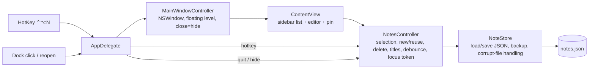

# feat: Quick Notes native Mac app

## Summary

Build a Swift Package with two targets: a tested core library that owns notes (create, edit, delete, order, persist) and a thin AppKit + SwiftUI app shell that owns the floating window, global hotkey, and launch-at-login. A build script assembles the executable into a locally signed `.app` bundle and installs it to `/Applications` — no Xcode project, no App Store.

---

## Problem Frame

User wants Windows-style quick capture on an Intel Mac (macOS 26.3). App Store is broken (can't install Plume) and Apple Notes' Quick Note shortcut does nothing. Greenfield repo; Xcode + Swift 6.3 installed. See origin for full framing.

---

## Requirements

Carried from origin (see origin: docs/brainstorms/2026-09-29-quick-notes-requirements.md):

- R1. Global hotkey from any app creates a new empty note, shows window, cursor in note.
- R2. Default hotkey avoids Globe/Fn key.
- R3. One window: note list left, editor right.
- R4. Window floats above other apps by default.
- R5. Pin toggle turns floating on/off; persists across launches.
- R6. Window can be minimized and closed; close hides, app keeps running, hotkey still works.
- R7. Quit fully exits.
- R8. Multiple notes; list titled by first line, newest first.
- R9. Selecting a note opens it in editor.
- R10. Plain text.
- R11. Autosave; survives quit, crash, reboot.
- R12. Delete a note; no undo/trash.
- R13. Built locally, installed to Applications without App Store.
- R14. Launches at login.

**Origin acceptance examples:** AE1 (covers R1, R6), AE2 (covers R1, R6), AE3 (covers R4, R5), AE4 (covers R11), AE5 (covers R8)

---

## Scope Boundaries

- Per-note sticky windows, colors, formatting, images, search, sync, Apple Notes import, App Store / notarized distribution, undo/trash (from origin)
- Settings UI for changing the hotkey (hotkey is a single constant in code)
- Menu bar icon
- Xcode project file

---

## Context & Research

### Relevant Code and Patterns

- Greenfield: repo is empty. No existing patterns, no `docs/solutions/`, no AGENTS.md/STRATEGY.md.

### External References

- Carbon `RegisterEventHotKey` — system-wide hotkey without Accessibility permission (unlike `NSEvent` global monitors, which require it and can't consume the event).
- `NSWindow.level = .floating` for always-on-top; `collectionBehavior` `[.moveToActiveSpace, .fullScreenAuxiliary]` so the window appears on the current Space and over full-screen apps.
- `SMAppService.mainApp` (ServiceManagement, macOS 13+) for launch-at-login.
- `@Observable` and `NSHostingController.sceneBridgingOptions` (toolbar bridging) require macOS 14.
- Swift Testing (`swift test`) available with Swift 6.3 toolchain.

---

## Key Technical Decisions

- **SwiftPM, not Xcode project**: plain-text `Package.swift` + build script is easier to diff and maintain than a `.pbxproj`; `swift test` runs core tests with no GUI.
- **macOS 14 minimum**: needed for `@Observable` and SwiftUI toolbar bridging into an AppKit window; target machine runs 26.3, so no cost.
- **Core library / app shell split**: all note logic in `QuickNotesCore` (no AppKit import) so it's unit-testable; shell is thin glue verified manually.
- **AppKit window hosting SwiftUI content**: SwiftUI builds the sidebar/editor; AppKit `NSWindow` gives direct control of floating level, close-hides, and hotkey-driven show. Pure SwiftUI `WindowGroup` makes close/float control awkward.
- **Hotkey ⌃⌥N via Carbon**: no permission prompt, consumes the keystroke system-wide. ⌥⌘N avoided (Finder uses it).
- **Blank notes never accumulate**: hotkey and New button reuse any existing whitespace-only note (newest) instead of creating another; a blank note is discarded when selection moves away from it or the window hides.
- **Order by creation date, newest first**: sorting by modification would reorder the list while typing.
- **Single JSON file** at `~/Library/Application Support/QuickNotes/notes.json`, atomic writes, debounced ~0.5s after edits plus flush on quit / window hide. First save of each launch copies the existing file to `notes.json.bak`. Corrupt file on load → renamed aside (`notes.corrupt-<timestamp>.json`), start empty; never overwritten. Any other read error → keep file untouched, store goes read-only (saves skipped and logged) for the session.
- **Delete confirms only for notes with text**: blank notes delete immediately; guards the "nothing typed is ever lost" criterion without adding undo/trash.
- **Pin state in UserDefaults**, default on.
- **Dock icon kept** (regular activation policy): needed for minimize; clicking Dock icon reopens hidden window.
- **Launch behavior**: login-item launch starts hidden (no window pop-up at login); manual launch shows the window. Any launch reselects the most recently edited note.
- **Login item registered once**: register on first launch only (UserDefaults flag); never re-register, so the user turning it off in System Settings sticks.
- **Ad-hoc code signing** in build script: enough for local launch and login-item registration.

---

## Open Questions

### Resolved During Planning

- Hotkey permission? None needed with Carbon hotkey API.
- Default shortcut? ⌃⌥N.
- Dock vs menu bar icon? Dock only.
- Local signing? Ad-hoc (`codesign -s -`) in build script.

### Deferred to Implementation

- Whether `SMAppService.mainApp.register()` succeeds for an ad-hoc-signed app on macOS 26.3, and what status it reports after the user disables it: verify at runtime; fallback in Risks.
- Whether ⌃⌥N conflicts with any app the user runs: discovered in use; changing is a one-constant edit.
- Exact debounce interval: tune by feel.
- Whether the SwiftUI toolbar renders via `sceneBridgingOptions` or needs an explicit `NSToolbar`: check in U3.
- How to detect a login-item launch vs manual launch (e.g., launch event inspection): pick in U5.

---

## Output Structure

    Package.swift
    Sources/
      QuickNotesCore/
        Note.swift
        NoteStore.swift
        NotesController.swift
      QuickNotes/
        main.swift
        AppDelegate.swift
        MainWindowController.swift
        ContentView.swift
        HotKey.swift
        LoginItem.swift
    Tests/
      QuickNotesCoreTests/
        NoteStoreTests.swift
        NotesControllerTests.swift
    Resources/
      Info.plist
    scripts/
      build-app.sh
    README.md

---

## High-Level Technical Design

> *This illustrates the intended approach and is directional guidance for review, not implementation specification. The implementing agent should treat it as context, not code to reproduce.*

---

## Implementation Units

- U1. **Package scaffold + note persistence**

**Goal:** SwiftPM package with core library, app executable, test target; `Note` model and `NoteStore` load/save.

**Requirements:** R10, R11

**Dependencies:** None

**Files:**
- Create: `Package.swift`
- Create: `Sources/QuickNotesCore/Note.swift`
- Create: `Sources/QuickNotesCore/NoteStore.swift`
- Create: `Sources/QuickNotes/main.swift` (placeholder so the package builds)
- Test: `Tests/QuickNotesCoreTests/NoteStoreTests.swift`

**Approach:**
- `Note`: id, plain-text body, created date, modified date; Codable.
- `NoteStore` takes a file URL (injectable for tests); creates parent directory; atomic write; load returns empty list only when file missing.
- Corrupt JSON on load → move file aside with timestamped name, return empty.
- Any other read error → leave file untouched, mark store read-only; saves are skipped and logged.
- First successful save per store instance copies existing file to `notes.json.bak` first.
- Save errors logged; next edit retries.
- Platform: `.macOS(.v14)`.

**Test scenarios:**
- Happy path: save 3 notes → load from same URL → identical ids, bodies, dates.
- Edge case: load when file doesn't exist → empty list, no error, no file created.
- Edge case: parent directory missing → save creates it.
- Edge case: body with emoji, newlines, very long text round-trips unchanged.
- Error path: file contains invalid JSON → load returns empty, original moved to `notes.corrupt-*.json`, content preserved there.
- Error path: file unreadable (permissions) → load reports error, store read-only, subsequent save does not touch file.
- Happy path: existing file + first save → `notes.json.bak` holds previous content.
- Covers AE4. Save, create new `NoteStore` instance on same URL, load → text intact.

**Verification:** `swift test` passes; `swift build` succeeds.

---

- U2. **Notes controller (behavior logic)**

**Goal:** Observable controller owning the notes list, selection, and all note behaviors; drives persistence.

**Requirements:** R1 (logic), R8, R9, R11, R12

**Dependencies:** U1

**Files:**
- Create: `Sources/QuickNotesCore/NotesController.swift`
- Test: `Tests/QuickNotesCoreTests/NotesControllerTests.swift`

**Approach:**
- `@MainActor @Observable` class: sorted notes (created desc), selected id, focus-request token.
- `newNote` (used by hotkey and New button): if any whitespace-only note exists, select the newest one; else create and select new note. Always increments focus-request token.
- Blank-note pruning: when selection moves away from a blank note, or on `windowWillHide`, remove it.
- Title: first non-empty line, trimmed; placeholder when empty.
- Update body → set modified date → schedule debounced save; `flush()` saves immediately.
- Delete: remove, select next note in list (or previous if last; nil if none), save. Controller exposes whether the note has text so the UI can decide to confirm.
- On load, select most recently modified note (or nil if none).
- Injectable save scheduler so tests don't sleep; tests annotated `@MainActor`.

**Test scenarios:**
- Happy path: create two notes → list order newest first.
- Covers AE5. Body "groceries\nmilk" → title "groceries"; empty body → placeholder title; body "\n\n  todo" → title "todo".
- Happy path: select note B → selected body is B's.
- Edge case: `newNote` with selected empty note → no new note, count unchanged.
- Edge case: empty note exists but a non-empty note is selected → `newNote` selects the empty note, count unchanged.
- Edge case: `newNote` with only non-empty notes → new note created and selected at top.
- Edge case: `newNote` with no notes → one note created, selected.
- Happy path: `newNote` increments focus-request token each call.
- Edge case: select blank note, then select another → blank note removed.
- Edge case: blank note selected, `windowWillHide` → blank note removed.
- Happy path: delete middle selected note → next note selected; delete last-in-list → previous selected; delete only note → selection nil, list empty.
- Happy path: load with several notes → most recently modified selected.
- Integration: edit body → flush → new `NoteStore` load shows edit.
- Edge case: rapid edits within debounce window → single save scheduled (via injected scheduler).
- Happy path: editing a note does not change list order.

**Verification:** all controller tests pass; no AppKit import in core.

---

- U3. **Window and UI**

**Goal:** Floating main window with sidebar list, editor, pin toggle, delete; close hides; Dock reopen; quit flushes.

**Requirements:** R3, R4, R5, R6, R7, R9, R12

**Dependencies:** U2

**Files:**
- Create: `Sources/QuickNotes/AppDelegate.swift`
- Create: `Sources/QuickNotes/MainWindowController.swift`
- Create: `Sources/QuickNotes/ContentView.swift`
- Modify: `Sources/QuickNotes/main.swift`

**Approach:**
- `main.swift` starts `NSApplication` with `AppDelegate` (held by a strong reference), regular activation policy, standard app menu (Quit ⌘Q, Edit menu for copy/paste/undo in text editor).
- Window: titled, closable, miniaturizable, resizable; `isReleasedWhenClosed = false`; delegate intercepts close → controller `windowWillHide` + flush + `orderOut`.
- `collectionBehavior` `[.moveToActiveSpace, .fullScreenAuxiliary]`.
- Window level `.floating` when pinned, `.normal` otherwise; pin state read/written to UserDefaults (default true).
- Hosting controller `sceneBridgingOptions` includes toolbars.
- `ContentView`: `NavigationSplitView` — sidebar list bound to controller selection with right-click Delete; detail `TextEditor` bound to selected body with `@FocusState`, `.id(selectedNoteID)` so each note gets its own undo history; toolbar with New, Delete, Pin toggle.
- Empty state: when no note selected, detail shows a placeholder with a New Note button and the hotkey hint. On first launch with no notes, controller creates one empty note so the editor is ready.
- Delete of a note with text shows a confirmation alert; blank notes delete immediately.
- `ContentView` watches controller focus-request token (`onChange`) and sets editor focus after selection updates.
- `applicationShouldHandleReopen` → show window. `applicationShouldTerminateAfterLastWindowClosed` → false. `applicationWillTerminate` → flush.
- Remember window frame via autosave name.

**Test scenarios:**
- Test expectation: none automated — AppKit glue. Manual checklist:
  - Covers AE3. Pin on → click another app → window stays on top. Pin off → other window can cover it. Relaunch → pin state kept.
  - Close button → window disappears, Dock icon remains; click Dock icon → window returns with same note selected.
  - Minimize → goes to Dock; restore works.
  - ⌘Q → app exits; relaunch → notes intact, last-edited note selected.
  - Right-click note with text → Delete → confirmation shown; confirm → removed, next selected. Blank note → deleted without prompt.
  - Delete last note → placeholder with New Note button shown.
  - Copy/paste/undo work in editor; undo after switching notes doesn't touch the previous note.

**Verification:** manual checklist passes on the user's Mac.

---

- U4. **Global hotkey**

**Goal:** ⌃⌥N from any app shows window and focuses a new (or reused empty) note.

**Requirements:** R1, R2, R6

**Dependencies:** U3

**Files:**
- Create: `Sources/QuickNotes/HotKey.swift`
- Modify: `Sources/QuickNotes/AppDelegate.swift`

**Approach:**
- Wrap Carbon `RegisterEventHotKey` + `InstallEventHandler` in a small class; key combo as one constant.
- Swift 6 concurrency: pass `Unmanaged.passUnretained(self)` as handler userData; non-capturing C handler recovers the instance and invokes the callback inside `MainActor.assumeIsolated` (Carbon delivers hotkey events on the main thread).
- On fire: `newNote`, deminiaturize if needed, `makeKeyAndOrderFront`, `NSApp.activate(ignoringOtherApps: true)` (plain `activate()` is cooperative on macOS 14+ and may not take focus); the focus-request token moves keyboard focus into the editor.
- Registration failure (combo taken) → log and show a one-time alert on launch saying the hotkey is unavailable and pointing to the README.

**Test scenarios:**
- Test expectation: none automated — OS integration. Manual:
  - Covers AE1. Window closed, Safari focused → ⌃⌥N → window on top, new empty note, keystrokes land in it without clicking.
  - Covers AE2. Window minimized → ⌃⌥N → window restored, new note.
  - Full-screen app frontmost → ⌃⌥N → window appears over it without switching desktops.
  - On a different desktop (Space) → ⌃⌥N → window appears on current desktop.
  - ⌃⌥N twice without typing → still one empty note.
  - No permission prompt appears.
  - Temporarily change combo to one already in use → alert shown on launch.

**Verification:** manual checks pass.

---

- U5. **Launch at login, bundle, install**

**Goal:** Build script produces signed `QuickNotes.app` in `/Applications`; app registers itself to launch at login once.

**Requirements:** R13, R14

**Dependencies:** U4

**Files:**
- Create: `Sources/QuickNotes/LoginItem.swift`
- Modify: `Sources/QuickNotes/AppDelegate.swift`
- Create: `Resources/Info.plist`
- Create: `scripts/build-app.sh`
- Create: `README.md`

**Approach:**
- `Info.plist`: `CFBundleIdentifier` (e.g. `local.quicknotes`), `CFBundleName`, `CFBundleExecutable` (`QuickNotes`), `CFBundlePackageType` (`APPL`), `CFBundleShortVersionString`, `CFBundleVersion`, `LSMinimumSystemVersion` 14.0, `NSHighResolutionCapable`.
- Script: release build → assemble `QuickNotes.app/Contents/{MacOS,Resources,Info.plist}` → ad-hoc sign → quit running instance → remove existing `/Applications/QuickNotes.app` → copy → open.
- Login item: on first launch only (UserDefaults flag), call `SMAppService.mainApp.register()`; never re-register afterwards. Failure logged, not fatal.
- Launch mode: detect login-item launch → start hidden; manual launch → show window.
- README: build/install command, hotkey, how to change hotkey (combo must include Control or Command; Option-only / Option+Shift-only combos are rejected on macOS 15+), where notes and backup live, how to remove the login item.

**Test scenarios:**
- Test expectation: none automated — packaging. Manual:
  - Run script → app opens from `/Applications` with no Gatekeeper block; window shown.
  - System Settings → Login Items lists QuickNotes.
  - Log out/in (or reboot) → app running with no window shown, ⌃⌥N works, notes intact (AE4).
  - Turn off login item in System Settings → relaunch app → login item stays off.
  - Rebuild + reinstall → notes intact, no stale files in bundle.

**Verification:** manual checks pass; rebuilding and reinstalling keeps notes.

---

## System-Wide Impact

- **State lifecycle risks:** debounce means a hard crash can lose ≤ ~0.5s of typing; flush on hide/quit covers normal exits. Atomic writes prevent half-written files; per-launch `.bak` guards against a bad in-memory state being saved.
- **Unchanged invariants:** notes file lives outside the app bundle, so reinstalling never touches notes.
- **Dev vs installed**: running `swift run` while the installed app runs means two writers on one notes file and a hotkey conflict — quit the installed app when developing.

---

## Risks & Dependencies

| Risk | Mitigation |
|------|------------|
| `SMAppService` rejects ad-hoc-signed app | README fallback: add manually in System Settings → Login Items |
| Rebuilt app with new ad-hoc signature re-registers or duplicates login item | Stable bundle id + install path; register-once flag; verify in U5 manual check |
| ⌃⌥N already used by another app | Launch alert on registration failure; single constant; README documents changing it |
| Carbon hotkey API deprecated in future macOS | Still functional on macOS 26; isolated in one file for swap |

---

## Sources & References

- **Origin document:** [docs/brainstorms/2026-09-29-quick-notes-requirements.md](../brainstorms/2026-09-29-quick-notes-requirements.md)
